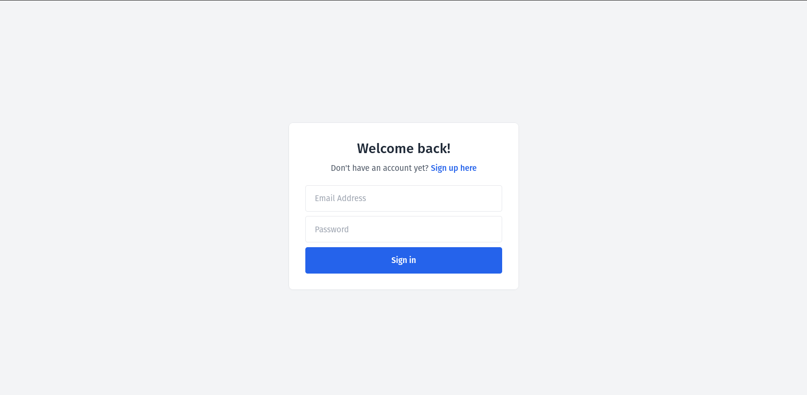
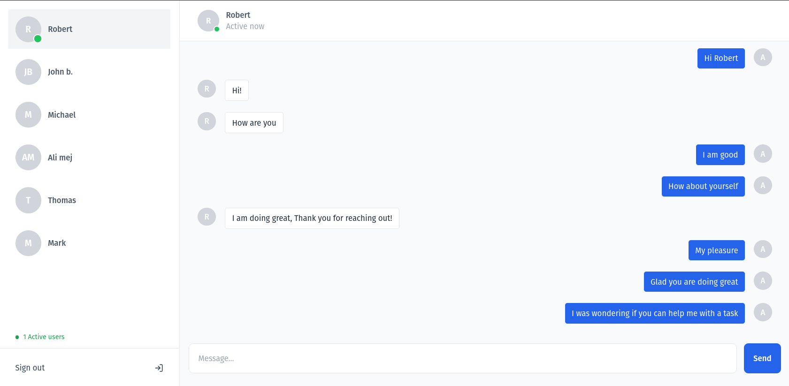

# MERN Stack Chat Application




<details>
  <summary>Table of Contents</summary>
  <ol>
    <li>
      <a href="#tech-stack">Tech Stack</a>
    </li>
    <li>
      <a href="#key-features">Key Features</a>
    </li>
    <li>
      <a href="#screenshots">Screenshots</a>
    </li>
    <li>
    <li>
      <a href="#development-setup">Development Setup</a>
      <ul>
        <li><a href="#prerequisites">Prerequisites</a></li>
        <li><a href="#steps">Steps</a></li>
      </ul>
    </li>
    <li><a href="#project-structure">Project Structure</a></li>
    <li><a href="#meta">Meta</a></li>
  </ol>
</details>

## Tech Stack

This project was built using the MERN stack and Tailwind.

[](https://skillicons.dev)

## Key Features

- **Authentication:**
  Secure login system for authorized access.

- **Real-Time Messaging:**
  Enable users to exchange messages in real-time, creating a seamless and instant communication experience.

- **Offline Messaging:**
  Allow users to send and receive messages even when they are temporarily offline. Messages should be delivered once the user is back online.

## Development Setup

Follow these steps to set up the project locally on your machine.

### Prerequisites

Make sure you have the following installed on your machine:

- [Git](https://git-scm.com/)
- [Node.js](https://nodejs.org/en)
- [npm](https://www.npmjs.com/) (Node Package Manager)

### Steps

Clone the repository

```bash
git clone https://github.com/ayyyub777/chat-application.git
```

Install the project dependencies using npm

```bash
cd client
npm install
```

```bash
cd ..
npm install
```

Create a new file named `.env` in the root of your project and add the following content:

```env
DATABASE_URI =
SECRET_KEY =
```

Run the project

```bash
npm run dev
```

Open [http://localhost:3000](http://localhost:3000) in your browser to view the project.

## Project Structure

```bash
├── .gitignore
├── README.md
├── client
│   ├── .eslintrc.cjs
│   ├── .gitignore
│   ├── README.md
│   ├── index.html
│   ├── package-lock.json
│   ├── package.json
│   ├── postcss.config.js
│   ├── src
│   │   ├── App.jsx
│   │   ├── actions
│   │   │   ├── getAllUsers.js
│   │   │   └── getMessagesById.js
│   │   ├── auth
│   │   │   ├── SignIn.jsx
│   │   │   └── SignUp.jsx
│   │   ├── components
│   │   │   ├── ChatHeader.jsx
│   │   │   ├── ChatInput.jsx
│   │   │   ├── Messages.jsx
│   │   │   ├── NoConvo.jsx
│   │   │   ├── PrivateRoute.jsx
│   │   │   ├── Sidebar.jsx
│   │   │   └── ui
│   │   │       └── Spinner.jsx
│   │   ├── context
│   │   │   └── ChatContext.js
│   │   ├── hooks
│   │   │   └── useWebSocket.js
│   │   ├── index.css
│   │   ├── main.jsx
│   │   ├── pages
│   │   │   ├── Chat.jsx
│   │   │   └── Error.jsx
│   │   ├── slices
│   │   │   ├── apiSlice.js
│   │   │   ├── authSlice.js
│   │   │   └── userInfoSlice.js
│   │   └── store.js
│   ├── tailwind.config.js
│   ├── utils
│   │   └── formatter.js
│   └── vite.config.js
├── package-lock.json
├── package.json
└── server
    ├── config
    │   ├── corsOptions.js
    │   └── dbconn.js
    ├── controllers
    │   ├── messageController.js
    │   └── userController.js
    ├── middleware
    │   ├── auth.js
    │   └── catchError.js
    ├── model
    │   ├── Message.js
    │   └── User.js
    ├── routes
    │   ├── messageRoutes.js
    │   └── userRoutes.js
    ├── server.js
    └── utils
        └── generateToken.js
```

## Meta

Ayoub Bigharassine – [LinkedIn](https://www.linkedin.com/in/ayoub-bigharassine/) – ayoub.bigharassine@gmail.com
